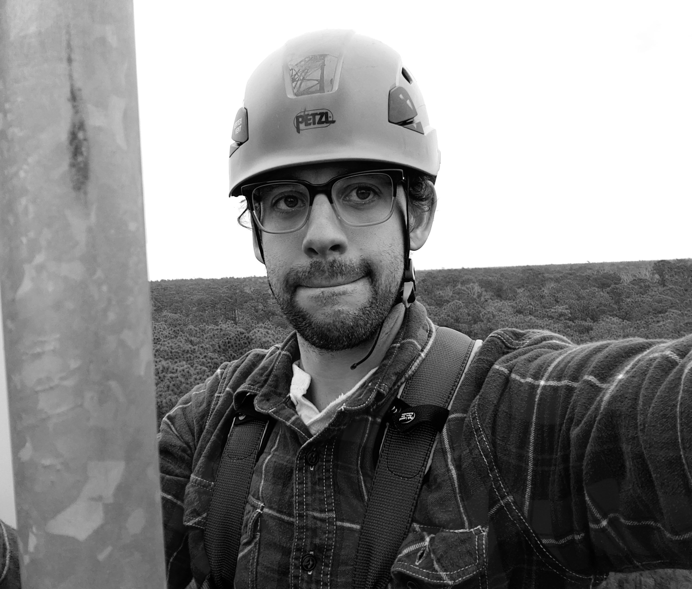
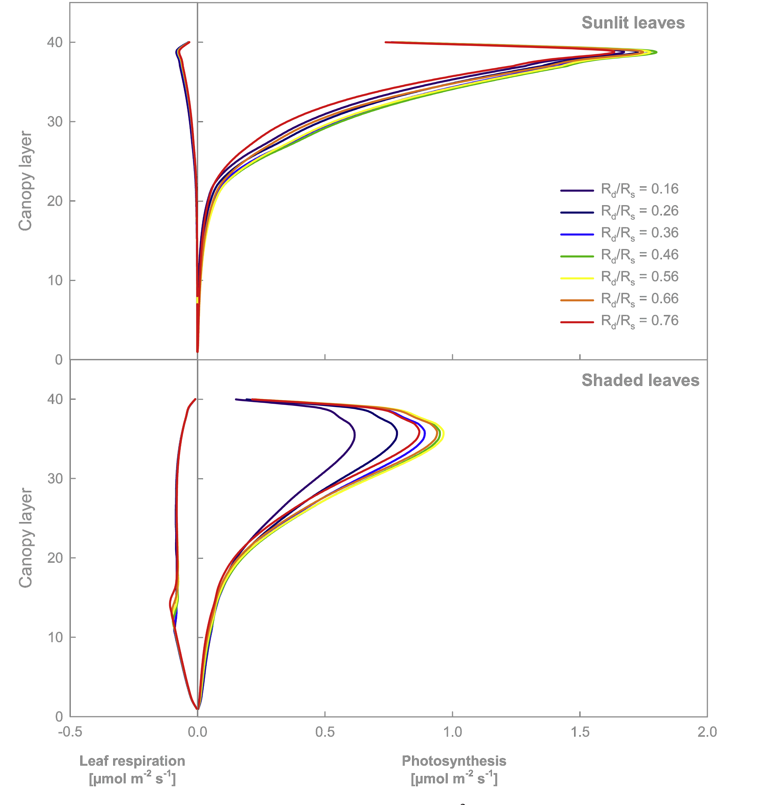
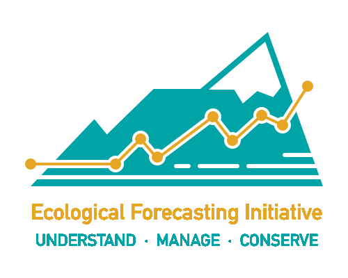
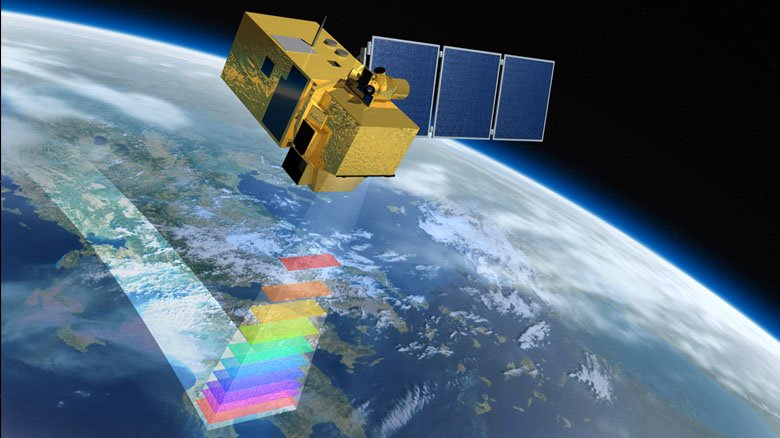

My name is Jeremy Forsythe and I am a PhD candidate at Clemson University. 

As an educator I am committed to designing and implementing courses and research experiences that are more accessible, equitable, and inclusive to historically marginalized students across intersections of race, gender, socioeconomic levels, and sexuality. I believe that the foundations of compassion and support are critical to building a teaching environment that holds students to high academic standards.

As an ecologist I am curious about the ecological mechanisms behind community assembly, disturbance recovery, ecosystem functioning, and the patterns of biodiversity. I recently have focused on the intersection between these mechanisms and land atmosphere interactions to answer questions about the sensitivity of ecosystem productivity (carbon sequestration) to environmental disturbance (e.g. fire, land management, extreme weather events). The results will contribute to our overall understanding of the land carbon sink, reducing uncertainty in future climate predictions and contributing to an assessment of how ecosystems might be managed as "natural climate solutions". My approach combines field based measurements of plant demographics & carbon stocks, ecosystem greenhouse gas exchange measured via state-of-the-art technology (i.e. eddy covariance), satellite remote sensing, and advanced quantitative & statistical methods to holistically quantify the effect of ecological mechanisms on greenhouse gas cycling.

In my spare time I enjoy listening to & playing music, vegan cooking, running, hiking, and learning new programming skills.

I am a member of the the following professional organizations: [The Ecological Society of America (ESA)](https://www.esa.org/), [The Society for the Advancement of Biology Education Research(SABER)](https://saberbio.wildapricot.org/), [FLUXNET Early Career Scientist Network (ECN)](https://fluxnet.org/community/ecn-early-career-scientist-network/), [American Association for the Advancement of Science](https://www.aaas.org/), [Ameriflux](https://ameriflux.lbl.gov/), and [The Honor Society of Phi Kappa Phi](https://www.phikappaphi.org/).

A copy of my CV can be downloaded [here](https://www.jeremyforsythe.dev/about/JForsytheCV.pdf)

### Education

* Ph.D. Student Forestry & Environmental Conservation (Jan.2019-present), Clemson University
* M.A. Ecology & Evolutionary Biology (August 2018), University of Kansas
* B.S. Biological Sciences (December 2013), University at Albany

### Research Projects Include:

*  Influence of Diffuse Light on Carbon Capture By Plants:
  * Atmospheric carbon dioxide (CO2) levels are growing at unprecedented rates to over 410 ppm (parts per million).
  * Trees effectively capture and store carbon in woody tissue through photosynthesis, leading them to be named the [leading natural climate solution to combat climate change](https://www.pnas.org/content/114/44/11645).
  * Incoming solar energy is one of the primary drivers of photosynthesis, but more energy does not always translate to more photosynthesis.
  * Under clear sky conditions top canopy leaves are often light saturated to the point of physiological stress while simultaneously the shaded leaves are receiving suboptimal levels of light because they are not directly in the beam. 
  * Conversely, under moderately cloudy conditions or when light scattering aerosols are present the incoming light is more evenly dispersed, reducing the strain on the top canopy leaves and allowing energy to penetrate deeper into the layers of the foliage, resulting in an overall significant increase photosynthesis.
  * I study how this "diffuse fertilization effect" affects forests and interacts with other drivers of photosynthesis. 
  * Figure reprinted from [Knohl & Baldocchi. 2008. Effects of diffuse radiation on canopy gas exchange processes in a forest ecosystem. Journal of Geophysical Research: Biogeosciences 113:1–17](https://agupubs.onlinelibrary.wiley.com/doi/full/10.1029/2007JG000663) shows leaf photosynthesis and respiration through canopy layers for different diffuse fractions.

*  Ecological Forecasting:
  * Ecology as a science has primarily been focused on describing events that have already past.
  We are realizing more and more that ecosystems do not always respond to environmental change
  as they have previously, especially under a changing climate.
  * In my research I am combining Bayesian statistics, data science, and ecological principles to make near-term carbon forecasts for forested ecosystems.

*  Optimizing Remote Sensing Light Use Efficiency Models:
  * Satellite-born spectral vegetation indices allow us to continually quantify properties of the land below across space and time, including the photosynthetic capacity of plant life, by measuring the reflectance of key wavelengths of light.
  * Using a simple model, GPP = APAR & &epsilon; (Gross Primary Productivity = Amount of absorbed sunlight * light use efficiency), we can estimate carbon sequestration anywhere and everywhere across the globe.
  * I am developing novel adaptations of this methodology specifically optimized to measure the potential carbon sink of ecosystems in the Southeastern United States, like Southern pine forests.

*  Ameriflux Data Pipeline:

  * Our lab has installed and activated a new network of environmental sensor towers
  (Eddy Covariance Flux) that measure the greenhouse gases, water, and heat exchanged between
  the ecosystems of coastal South Carolina and the atmosphere above.
  * I developed a workflow to take our high frequency (up to 10x per second)
  data from the sensors through quality checking and processing to create a cleaned dataset
  accessible and usable by anyone interested.
  * We have 4 towers currently built, operating, and registered with the Ameriflux network.
  For more information please visit [the O'Halloran Coastal Flux Lab's website](https://sites.google.com/g.clemson.edu/ohalloran/tower-sites) or read our publication: Forsythe, J. D., T. L. O’halloran, and M. A. Kline. 2020. <a href="https://www.mdpi.com/856994" target="_blank"> An eddy covariance mesonet for measuring greenhouse gas fluxes in coastal South Carolina.</a> Data 5:1–20.

<i class='fas fa-tree'></i><i class='fas fa-tree'></i><i class='fas fa-tree'></i>

