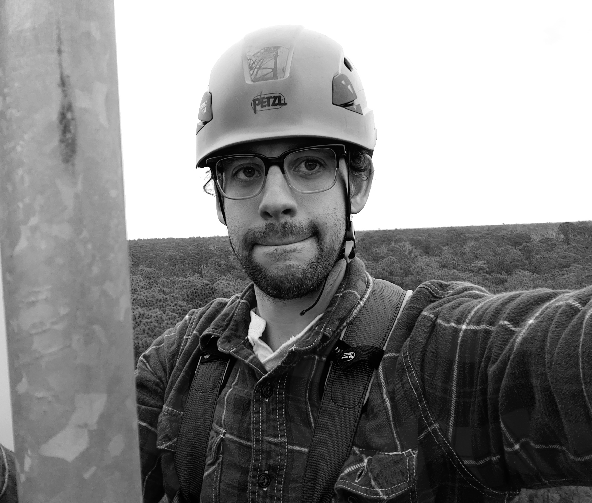
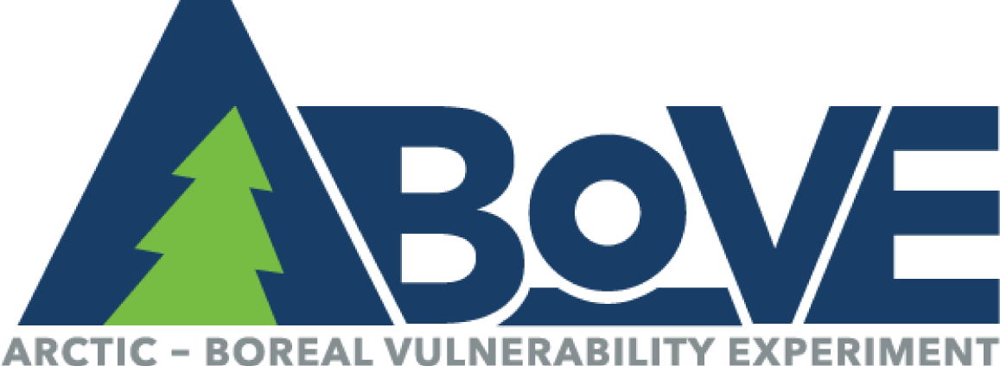
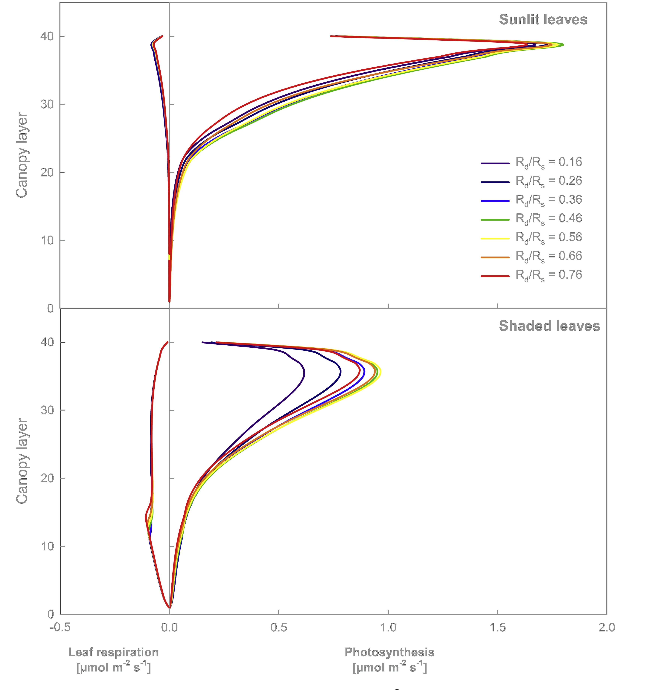
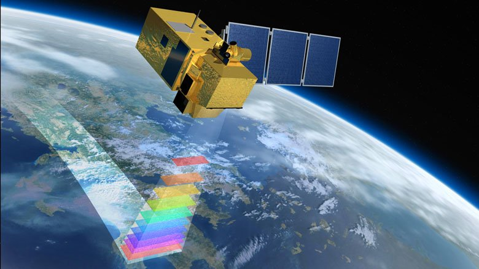
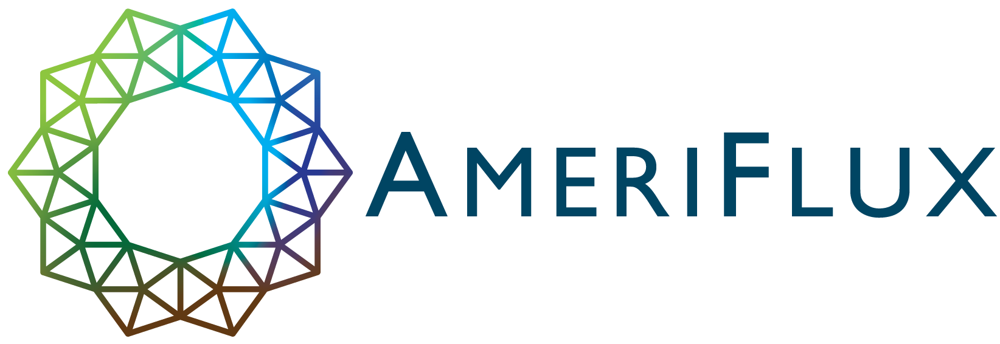

My name is **Jeremy Forsythe**. I am an ecologist and remote-sensing scientist working as a Research Associate at Northern Arizona University with NASA's Arctic-Boreal Vulnerability Experiment (ABoVE) and the Bonanza Creek Long-Term Ecological Research program. I completed my Ph.D. in Forestry & Environmental Conservation at Clemson University in May 2026.

I study how disturbance, climate, and land management shape plant communities, ecosystem functioning, and recovery across space and time. My research integrates field observations, eddy-covariance measurements of land-atmosphere exchange, satellite remote sensing, and statistical and machine-learning models. I am most energized by collaborative work that connects ecological mechanisms with actionable questions about wildfire, restoration, carbon and water cycling, and ecosystem resilience.

In my current position, I serve as a bridge between field ecology and remote-sensing teams studying boreal wildfire and reburning. I combine Landsat observations, climate data, historical fire records, and field knowledge to examine fire-climate-vegetation interactions and support the design and interpretation of field studies across Alaska and boreal North America.

My doctoral research focused on how light quality and canopy structure influence carbon uptake and water use in Southern pine forests. I helped build and maintain a four-site AmeriFlux eddy-covariance network, developed reproducible data-processing workflows, and integrated tower measurements with satellite observations and interpretable machine-learning methods.

Living and working in Austin, Los Angeles, and Flagstaff deepened my interest in dryland ecosystems. I am increasingly focused on how water limitation, disturbance, land use, soil properties, and restoration shape vegetation establishment and long-term resilience. I am especially excited by NASA's [Adaptation and Response in Drylands (ARID) initiative](https://doi.org/10.3334/ORNLDAAC/2408) and its coordinated use of field, research-network, airborne, satellite, and modeling approaches.

As an educator and mentor, I work to make ecology, remote sensing, and quantitative methods more accessible. I have developed [open-source NASA ECOSTRESS curriculum](https://www.observingearthfromabove.com/), taught remote sensing and ecological data science, mentored undergraduate researchers, and organized inclusive coding and writing communities (SnackOverflow). I believe compassion, clarity, and support are essential to a learning environment that also holds students to high academic standards.

In my spare time, I enjoy listening to and playing music, cooking, running, hiking, and learning anything new.

A copy of my CV can be downloaded [here](https://www.jeremyforsythe.dev/about/JForsytheCV.pdf).

### Education

* **Ph.D., Forestry & Environmental Conservation**, Clemson University, May 2026
* **M.A., Ecology & Evolutionary Biology**, University of Kansas, August 2018
* **B.S., Biological Sciences**, University at Albany, December 2013

### Current and Recent Research

#### Wildfire, Reburning, and Forest Change in Arctic-Boreal North America

* Map short-interval reburning across boreal North America using Landsat observations and historical fire perimeters.
* Examine how fire weather, vegetation, and time since a previous burn interact to shape subsequent fire size and severity.
* Connect remote-sensing analyses with field ecology and management perspectives through collaborations with NASA ABoVE, Bonanza Creek LTER, the Alaska Fire Science Consortium, and the Interagency Arctic Research Policy Committee.

#### Light Quality, Carbon Uptake, and Water Use

* Examined how direct and diffuse sunlight influence photosynthetic carbon uptake, evapotranspiration, sap flow, and water-use efficiency in Southern pine forests.
* Used eddy-covariance observations and interpretable machine learning to evaluate the environmental controls on daily light-use efficiency.
* Studied how canopy light distribution links leaf-scale mechanisms with whole-ecosystem carbon and water exchange.
* Figure adapted from [Knohl & Baldocchi (2008), *Journal of Geophysical Research: Biogeosciences*](https://agupubs.onlinelibrary.wiley.com/doi/full/10.1029/2007JG000663).

#### Remote Sensing of Ecosystem Productivity

* Develop satellite-informed light-use-efficiency models that translate site-level flux measurements across space and time.
* Combine vegetation indices, climate data, and eddy-covariance observations to estimate ecosystem productivity and evaluate environmental controls on carbon uptake.
* Build reproducible geospatial workflows using Landsat, Sentinel-2, MODIS, ECOSTRESS, Google Earth Engine, Python, R, GDAL, QGIS, and ArcGIS.

#### Coastal South Carolina AmeriFlux Mesonet and Open Data Pipeline

* Helped build and maintain a four-tower eddy-covariance network measuring exchanges of carbon dioxide, water, and energy across forest, agricultural, and wetland ecosystems from 2019 through 2025.
* Maintained instrumentation, calibration systems, off-grid solar power, telemetry, and remote field infrastructure.
* Developed workflows that transform high-frequency raw observations into quality-controlled, gap-filled, and openly accessible AmeriFlux data products.
* Learn more through the [O'Halloran Coastal Flux Lab](https://sites.google.com/g.clemson.edu/ohalloran/tower-sites) or our publication, [*An Eddy Covariance Mesonet for Measuring Greenhouse Gas Fluxes in Coastal South Carolina*](https://www.mdpi.com/856994).

<i class='fas fa-tree'></i><i class='fas fa-tree'></i><i class='fas fa-tree'></i>

