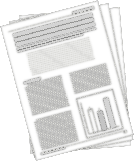
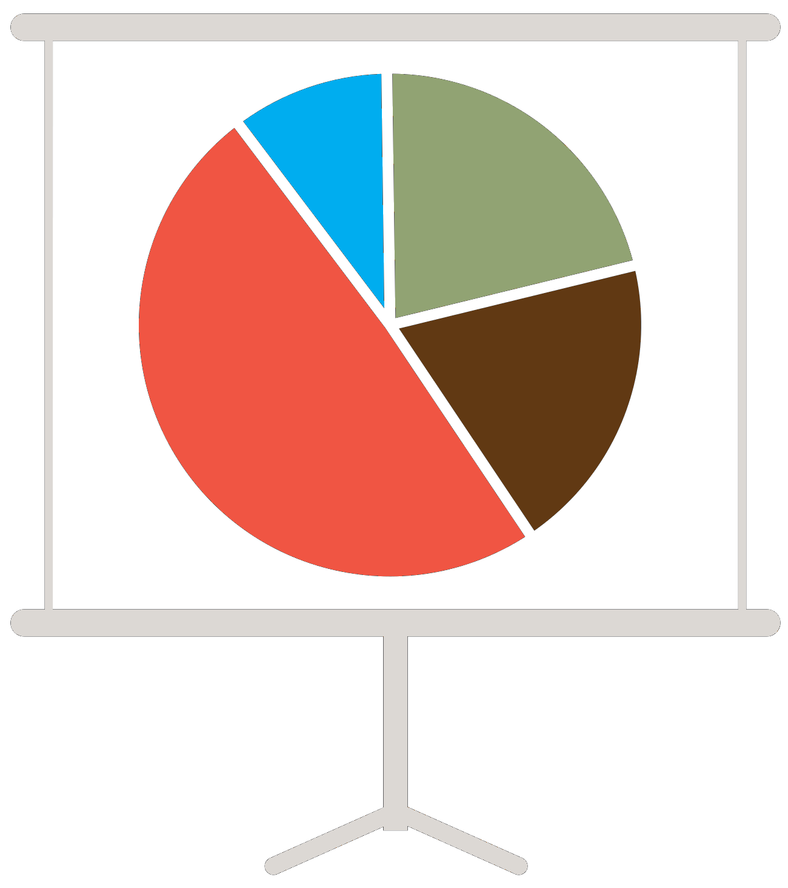

### Publications

<ul>
<li>Ahlswede, B. J., O'Halloran, T. L., Forsythe, J. D., & Thomas, R. Q. (2021). <a href="https://onlinelibrary.wiley.com/doi/10.1111/gcbb.12897" target="_blank"> A minimally managed switchgrass ecosystem in a humid subtropical climate is a source of carbon to the atmosphere.</a> GCB Bioenergy, 14, 24-36.</li>
<li> Forsythe, J. D., T. L. O'halloran, and M. A. Kline. 2020. <a href="https://www.mdpi.com/856994" target="_blank"> An eddy covariance mesonet for measuring greenhouse gas fluxes in coastal South Carolina.</a> Data 5:1-20.</li>
</ul> 

### Posters & Presentations

<ul>
<li> O'Halloran, T.L., J.D. Forsythe, L. Clay. Managing land to sequester carbon and greenhouse gases. SC Soil and Water Conservation Society (invited).  Charleston, SC.  February 21, 2022.
<li> O'Halloran, T.L., C. DeGarady, M. Motallebi, B.S. Song., L. Clay, J.D. Forsythe. Carbon and climate benefits of longleaf pine forests. SC Native Plant Society, Lowcountry Chapter (invited; virtual).  February 15, 2022.
<li> Forsythe J D, O'Halloran T L, Williams T, Kaminski R, Kline M A. <a href="https://www.researchgate.net/publication/349702383_An_Eddy_Covariance_Mesonet_Measuring_Coastal_Carbon_Fluxes_in_South_Carolina" target="_blank">  An Eddy Covariance Mesonet Measuring Coastal Carbon Fluxes in South Carolina. </a> Poster presented at: 7th North American Carbon Program Open Science Meeting; 2021 March. DOI: 10.13140/RG.2.2.21100.28804 </li>
<li> Forsythe J D, O'Halloran T L, Kline M A. <a href="https://www.researchgate.net/publication/344619699_Establishing_An_Eddy_Covariance_Mesonet_in_Coastal_South_Carolina" target="_blank"> Establishing An Eddy Covariance Mesonet in Coastal South Carolina. </a> Poster presented at: Ameriflux 2020; 2020 October 8. DOI: 10.13140/RG.2.2.13901.26086 </li>
<li> Forsythe JD, Foster, BL. <a href="https://www.researchgate.net/publication/349992641_The_Effects_Of_Disturbance_And_Soil_Nutrient_Enrichment_On_Grassland_Community_Biodiversity_Across_Spatial_Scales" target="_blank"> The Effects Of Disturbance And Soil Nutrient Enrichment On Grassland Community Biodiversity Across Spatial Scales. </a> Poster presented at: University of Kansas Madison
& Lila Self Graduate Fellowship Symposium. DOI: 10.13140/RG.2.2.26076.92806 </li>
</ul> 