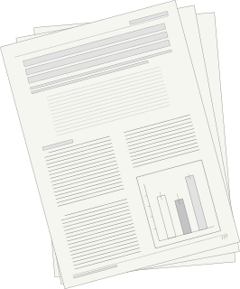

### Publications

<ul>
<li>Maricar Aguilos, Ge Sun, Ning Liu, Yulong Zhang, Gregory Starr, Andrew Christopher Oishi, Thomas L O'Halloran, Jeremy Forsythe, Jingfeng Wang, Modi Zhu, Devendra Amatya, Benju Baniya, Steve McNulty, Asko Noormets, John King. <a href="https://t.co/L7lVIgYXIy" target="_blank"> Energy availability and leaf area dominate control of ecosystem evapotranspiration in the southeastern U.S.</a>, Agricultural and Forest Meteorology, Volume 349, 2024,109960, ISSN 0168-1923,https://doi.org/10.1016/j.agrformet.2024.109960.
<li>Williams, T.M., B. Williams, B. Song, T.L. O'Halloran, J.D. Forsythe. 2022. <a href="http://mcfns.net/index.php/Journal/article/view/14.3" target="_blank"> Mapping natural forest stands with low-cost drones.</a> Mathematical and Computational Forestry & Natural-Resource Sciences: Vol. 14: Iss.1, pp 22-42.
<li>Ahlswede, B. J., O'Halloran, T. L., Forsythe, J. D., & Thomas, R. Q. 2021. <a href="https://onlinelibrary.wiley.com/doi/10.1111/gcbb.12897" target="_blank"> A minimally managed switchgrass ecosystem in a humid subtropical climate is a source of carbon to the atmosphere.</a> GCB Bioenergy, 14, 24-36.</li>
<li>Williams, T.M., T.L. O'Halloran, B. Song, J.D. Forsythe, and B.J. Williams. 2021. <a href="https://www.jeremyforsythe.dev/publications/local/SOFOR_Proceedings_FINAL_2021.pdf" target="_blank"> Sources of error from dense understory vegetation in Coastal Plain forest hydrologic analyses using LiDAR DEMs.</a> In Proceedings 13th Southern Forestry and Natural Resource Management GIS Conference. Athens, GA. pp. 41.</li>
<li>Williams, T.M., T.L. O'Halloran, B. Song, J.D. Forsythe, and B.J. Williams. 2020. <a href="https://www.jeremyforsythe.dev/publications/local/gtr_srs264.pdf" target="_blank">  Evaluating high water table hydrology and eddy covariance measurements of evapotranspiration at a newly instrumented watershed in coastal South Carolina.</a> In Proceedings 7th Interagency Conference on Research in the Watersheds. Tifton, GA: USDA-Agricultural Research Service. pp. 47.
<li> Forsythe, J. D., T. L. O'halloran, and M. A. Kline. 2020. <a href="https://www.mdpi.com/856994" target="_blank"> An eddy covariance mesonet for measuring greenhouse gas fluxes in coastal South Carolina.</a> Data 5:1-20.</li>
</ul> 

### Posters & Presentations

<ul>
<li> Forsythe J D, O'Halloran T L. <a href="https://www.researchgate.net/publication/374841315_DIFFUSE_LIGHT_EVAPOTRANSPIRATION_IN_SOUTHERN_PINE_FORESTS" target="_blank"> Diffuse Light & Evapotranspiration in Southern Pine Forests. </a> Invited talk presented at: ECOSTRESS Science and Application Team Meeting - Fall 2023. DOI: 10.13140/RG.2.2.18362.77769. </li>
<li> Forsythe J D <a href="https://www.researchgate.net/publication/374841247_Writing_Tutorials_For_Accessing_Visualizing_ECOSTRESS_Data_With_Open_Source_Tools" target="_blank">  Writing Tutorials For Accessing & Visualizing ECOSTRESS Data With Open Source Tools. </a> Invited talk presented at: ECOSTRESS Science and Application Team Meeting - Fall 2023. DOI: 10.13140/RG.2.2.26751.38563. </li>
<li> Forsythe J D, O'Halloran T L. <a href="https://www.researchgate.net/publication/374841233_Responses_of_Southern_Pine_Forest_Gross_Primary_Productivity_to_Diffuse_Radiation_A_17_Site-Year_Study" target="_blank">  Responses of Southern Pine Forest Gross Primary Productivity to Diffuse Radiation: A 17 Site-Year Study. </a> Talk presented at: Ecological Society of America 08/2023. DOI: 10.13140/RG.2.2.35978.85443. </li>
<li> Forsythe J D, O'Halloran T L. <a href="https://www.researchgate.net/publication/370863473_Sensitivity_of_Diffuse_Light_Fertilization_in_Southern_Pine_Carbon_Fluxes_Observed_with_Remotely-Sensed_Vegetation_Indices" target="_blank">  Sensitivity of Diffuse Light Fertilization in Southern Pine Carbon Fluxes Observed with Remotely-Sensed Vegetation Indices. </a> Talk presented at: American Meteorological Society 35th Conference; 05/2023. DOI: 10.13140/RG.2.2.13047.60320. </li>
<li> Forsythe J D, O'Halloran T L, Wise M, Balkcum O, Song B, Kline M A, DeGarady C. <a href="https://www.researchgate.net/publication/364811810_How_do_fire_management_alter_longleaf_pine_understory_carbon_stocks_whole_ecosystem_carbon_sequestration" target="_blank">  How do fire & management alter longleaf pine understory carbon stocks & whole ecosystem carbon sequestration?. </a> Poster presented at: 14th Biennial ​Longleaf Conference; 2022 October 27. DOI: 10.13140/RG.2.2.24852.37762 </li>
<li> J.D. Forsythe, O'Halloran, T.L. Carbon Management & Clearcut Recovery in Longleaf Pine Ecosystems. Jones Center at Ichauway (invited). Newton, GA.  April 11, 2022.
<li> O'Halloran, T.L., J.D. Forsythe, L. Clay. Managing land to sequester carbon and greenhouse gases. SC Soil and Water Conservation Society (invited).  Charleston, SC.  February 21, 2022.
<li> O'Halloran, T.L., C. DeGarady, M. Motallebi, B.S. Song., L. Clay, J.D. Forsythe. Carbon and climate benefits of longleaf pine forests. SC Native Plant Society, Lowcountry Chapter (invited; virtual).  February 15, 2022.
<li> Balkcum O, Song B, Forsythe J D, Wise M, Kline M A, O'Halloran T L. Marshes Migrating Into Forests: Effects of Sea Level Rise on Coastal Ecosystems. Poster presented at Clemson University Baruch Institute of Coastal Ecology and Forest Science Behind the Gate; Georgetown SC, 2021 July.
<li> Wise M., Forsythe J.D., Song B., Balkcum O., Kline M.A., O'Halloran T.L. How Does Fire Alter Carbon Stocks and Plant Diversity in a Longleaf Pine Understory? Poster presented at Clemson University Baruch Institute of Coastal Ecology and Forest Science Behind the Gate; Georgetown SC, 2021 July.
<li> Kuleba A, O'Halloran T L, Rady J, Powell L, Forsythe J D. Role of Phenology in Switchgrass Carbon Fluxes. Poster presented at Clemson University Baruch Institute of Coastal Ecology and Forest Science Behind the Gate; Georgetown SC, 2021 July.
<li> Clay, L., Forsythe, J.D., and O'Halloran, T.L. Comparing Carbon Dioxide and Methane Fluxes between a Natural Salt Marsh and Managed Wetlands. Behind the Gate. Baruch Institute for Coastal Ecology and Forest Science, 2021 July.
<li> Forsythe J D, O'Halloran T L, Williams T, Kaminski R, Kline M A. <a href="https://www.researchgate.net/publication/349702383_An_Eddy_Covariance_Mesonet_Measuring_Coastal_Carbon_Fluxes_in_South_Carolina" target="_blank">  An Eddy Covariance Mesonet Measuring Coastal Carbon Fluxes in South Carolina. </a> Poster presented at: 7th North American Carbon Program Open Science Meeting; 2021 March. DOI: 10.13140/RG.2.2.21100.28804 </li>
<li> Forsythe J D, O'Halloran T L, Kline M A. <a href="https://www.researchgate.net/publication/344619699_Establishing_An_Eddy_Covariance_Mesonet_in_Coastal_South_Carolina" target="_blank"> Establishing An Eddy Covariance Mesonet in Coastal South Carolina. </a> Poster presented at: Ameriflux 2020; 2020 October 8. DOI: 10.13140/RG.2.2.13901.26086 </li>
<li> Forsythe JD, Foster, BL. <a href="https://www.researchgate.net/publication/349992641_The_Effects_Of_Disturbance_And_Soil_Nutrient_Enrichment_On_Grassland_Community_Biodiversity_Across_Spatial_Scales" target="_blank"> The Effects Of Disturbance And Soil Nutrient Enrichment On Grassland Community Biodiversity Across Spatial Scales. </a> Poster presented at: University of Kansas Madison
& Lila Self Graduate Fellowship Symposium. DOI: 10.13140/RG.2.2.26076.92806 </li>
</ul> 