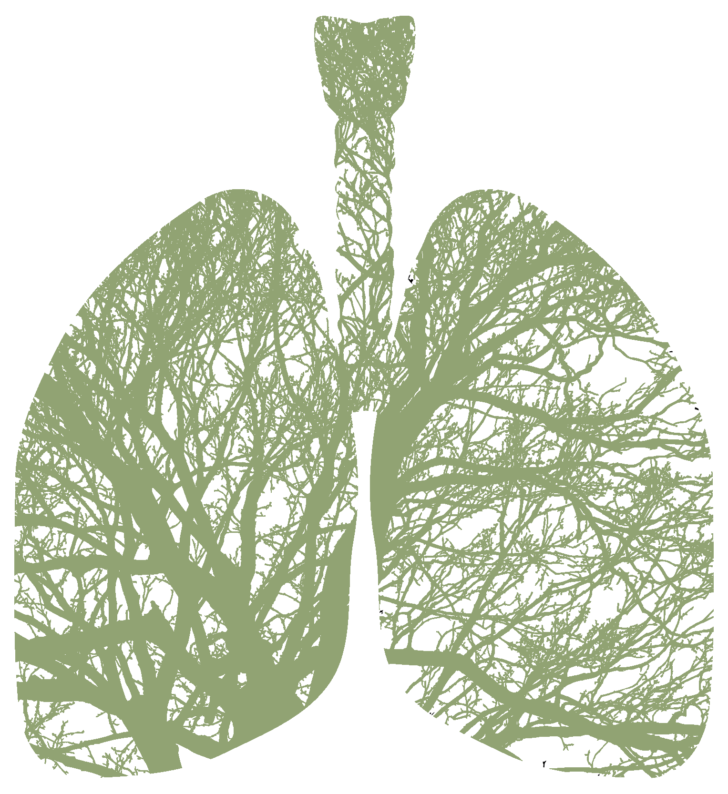
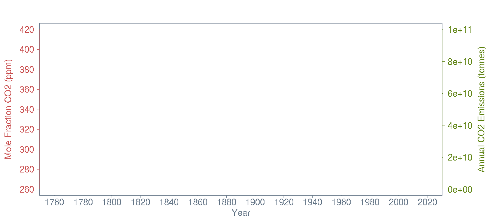

# First Post : Measuring The Breathing of the Biosphere

In this article I talk about what it means to be measuring the "Breathing of the Biosphere",
offer some foundational information about climate science, and introduce our eddy covariance flux instruments. The photo above is of our lab technician Mike Kline and myself installing a methane sensor on our latest tower, US-HB4, located above a managed brackish wetland.

<!--more-->

<i class='fas fa-tree'></i><i class='fas fa-tree'></i><i class='fas fa-tree'></i>

### Do Plants Breathe?

Many elementary school teachers have a lesson about breathing, teaching children
that when we breathe we are taking in oxygen and releasing carbon dioxide. To reassure
any students (read: 3rd grade me) thinking that the supply of oxygen may be running
low given how long humans had been around, teachers talk abut the balance between
the oxygen that we breathe and the oxygen produced by plants. It is a back and forth, we need oxygen
and give off the by-product carbon dioxide, while plants need carbon dioxide and release oxygen.

All of this is correct and when I teach the plant life unit in General Biology I start off telling this story
to the first year freshmen. Then I follow up with the question, do plants undergo aerobic respiration?
Typically the response is mixed with at least a few uneasy facial expressions in the room. For
some students, particularly those not majoring in the sciences, the balancing act of
oxygen and carbon dioxide by plants and animals is as far as they have ever thought of it.
Furthermore, we make associations based on what is familiar. The word respiration is often used
to define the work of the human respiratory system, the transport of oxygen between cells and the environment by our lungs.

Plants do undergo aerobic respiration, as a matter of fact all plants and animals use the process of respiration to convert chemical energy (like sugar) to a form of energy able to be used by our cells (ATP, Adenosine triphosphate). Plants are autotrophs of course, and create their own chemical energy through photosynthesis,while heterotrophs like us need to eat food. So while plants do not have lungs or gills, we can think of them as breathing because they are constantly exchanging oxygen (via photosynthesis) and carbon dioxide (via aerobic respiration) with the environment around them.

### Why Do We Study This Breathing?

<figure>
 
 <figcaption> The rapid increase in the concentration and emissions of carbon dioxide in the atmosphere following the Industrial Revolutions. Data Sourced From <a href="https://www.climate.gov/news-features/understanding-climate/climate-change-atmospheric-carbon-dioxide">Climate.gov</a> and <a href="https://ourworldindata.org/co2-and-other-greenhouse-gas-emissions#how-have-global-co2-emissions-changed-over-time">Our World In Data.</a>
 </figcaption>
</figure>

Beyond the desire to simply understand more of how the world around us works there is at least one strong motivator for studying the exchanges between the atmosphere and life here on earth. Greenhouse gas concentrations have been growing at unprecedented rates due to emissions from fossil fuel combustion and cement manufacturing through the calcination process of limestone. This is cause for major concern as carbon dioxide was shown to trap heat through the greenhouse effect by the Chemistry Nobel Prize winner 	Svante Arrhenius in 1896. We measure this phenomenon as radiative forcing or the difference between incoming solar radiation absorbed by the Earth and energy radiated back to space.

The radiative forcing caused by the sudden increase in greenhouse gas emissions following the industrial revolutions has already increased the mean global temperature +1.25°C and has been predicted to exceed another +1°C in less than 20 years [(U.S. Global Change Research Program, Second State of the Carbon Cycle Report)](https://doi.org/10.7930/SOCCR2.2018.Ch1). Even with a not-so-guaranteed future reduction in global emissions, the Intergovernmental Panel on Climate Change mitigation scenarios still assume some kind of large-scale reduction in atmospheric carbon dioxide concentrations to effectively limit the increase in global mean temperature [(Natural Climate Solutions - Griscom et al. 2017)](https://www.pnas.org/content/pnas/114/44/11645.full.pdf).

So how is CO2 removed from the atmosphere? There are two pathways, through diffusion with the ocean and through photosynthesis. Currently Earth's oceans are absorbing about 30% of all anthropogenic carbon emissions [(The Oceanic Sink for Anthropogenic CO2 - Sabine et al. 2004)](https://science.sciencemag.org/content/305/5682/367), but this is creating a gradual decrease in pH that is shifting the oceans to become more acidic, disrupting the life processes of many marine organisms and having clear socioeconomic impacts.

The photosynthetic pathway on the other hand represents a win-win scenario as plant communities can contribute to climate change mitigation through the biosequestration of atmospheric carbon while simultaneously offering economic, ecological, and cultural benefits to society. Under the proper management plan, these benefits could include reforestation, more raw materials like bioenergy feedstock or timber, and an increase in agricultural production. One of my research goals is to explore the mechanisms driving the carbon capture rates, which in turn can inform policy makers and land managers as how to maximize the benefits and minimize the cost.

### How Do We Study The "Breathing of The Biosphere"?

<iframe width="490" height="275.625" src="https://www.youtube.com/embed/CR4Anc8Mkas" frameborder="0" allow="accelerometer; autoplay; encrypted-media; gyroscope; picture-in-picture" allowfullscreen></iframe>

I first saw the phrase "Breathing of Biosphere" in a [turner review](https://www.publish.csiro.au/bt/BT07151) paper by Dennis Baldocchi. In it he describes the adoption of eddy covariance flux technology by ecologists. Once a procedure only used by specialists in the field of meteorology, it's use has since broadened to become the prominent methodology for studying the exchanges of energy and gases between the atmosphere and the biosphere.

Eddy covariance flux towers are constructed over an ecosystem of interest and are comprised of state-of-art sensors that are able to rapidly measure gas concentrations, heat, wind speed, and other meteorological variables.  For more information on the science behind eddy covariance check out the above video from NEON, the National Ecological Observatory Network, and [this free textbook from G. Burba and D. Anderson of LI-COR Biosciences](https://www.licor.com/env/pdf/eddy_covariance/Brief_Intro_Eddy_Covariance.pdf).

<i class='fas fa-tree'></i><i class='fas fa-tree'></i><i class='fas fa-tree'></i>

